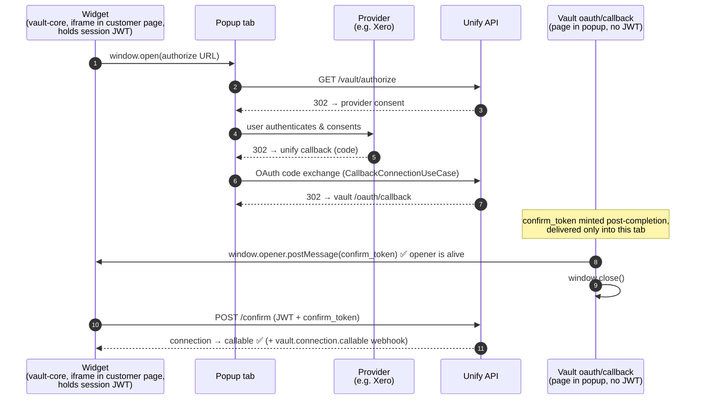
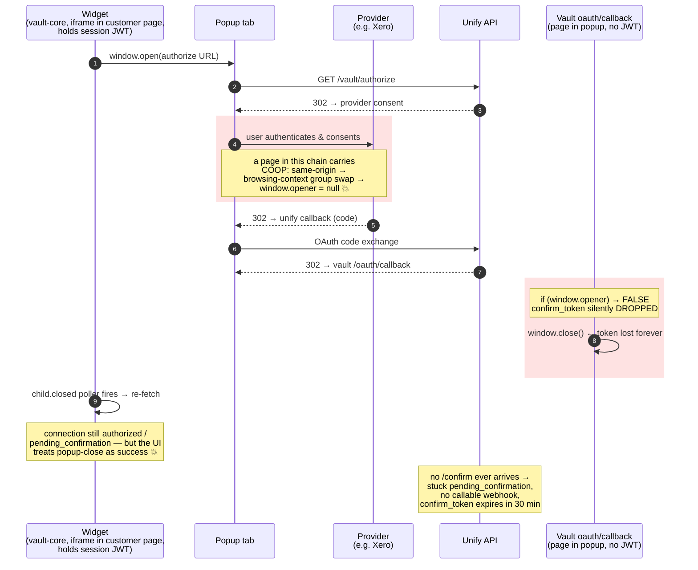
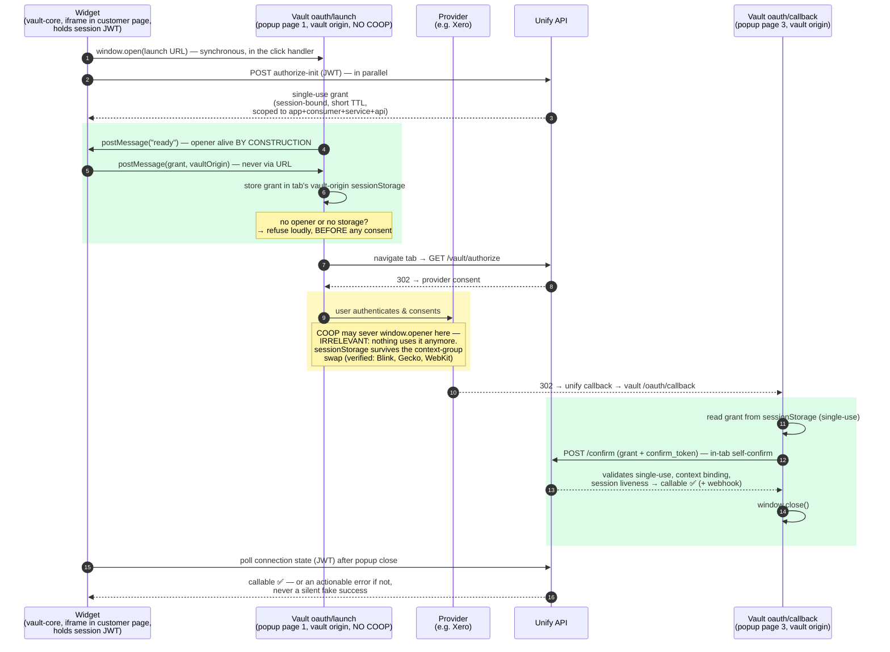

# OAuth confirm handoff — current vs. proposed flow (sequence diagrams)

**Date:** 2026-07-16
**Related:**
- Problem & security requirements: [`2026-07-14-oauth-confirm-iframe-context.md`](./2026-07-14-oauth-confirm-iframe-context.md)
- Failure repro: [`example/opener-severed-confirm/`](../../../example/opener-severed-confirm/)
- Design go/no-go experiment (GO on Blink, Gecko, WebKit): [`example/storage-roundtrip/`](../../../example/storage-roundtrip/)

An embedded (vault-core) OAuth connection only becomes `callable` after a
client-driven `POST /confirm` carrying the single-use `confirm_token`. The
diagrams below show how that token travels today, exactly where it dies, and
how the proposed design reroutes it.

---

## 1. Current behavior — happy path (opener intact)

The `confirm_token` travels **backwards** out of the popup via
`window.opener.postMessage`, and the widget (which holds the session JWT)
redeems it.

---

## 2. Current behavior — the failure (opener severed by COOP)

When any page in the popup's navigation chain (provider or callback) is served
with `Cross-Origin-Opener-Policy: same-origin`, the browser moves the popup
into a new browsing-context group and **`window.opener` becomes `null`**.
Deterministic per configuration — for a nested-iframe embedder like OCTA it
fails 100% of the time.

**Why no client-side patch fixes this as-is:** the callback page has no JWT
(it cannot self-confirm), and every backwards channel from a top-level popup
into a nested cross-origin iframe — opener, BroadcastChannel, localStorage,
relay iframes — is destroyed by the same COOP severance or by storage
partitioning. The opener channel is simultaneously the CSRF gate and the
failure.

---

## 3. Proposed behavior — grant handed forward at open time

Invert the direction: don't carry the secret backwards after completion —
carry a delegation **forwards at open time**, when the opener link is
guaranteed alive because the popup's first page (`oauth/launch`) is
vault-origin and served **without COOP**. The popup then confirms itself
in-tab; nothing ever travels popup → widget.

### Why the CSRF gate still holds

Confirmation requires two halves that only ever coexist in the legitimate tab:

| Half | Minted | Reachable by a phisher who hands out a link? |
|---|---|---|
| `confirm_token` | post-completion, at the callback | No — it never leaves the completer's tab (today it crosses a `postMessage('*')` hop; the proposal removes even that) |
| grant | at initiation, from the widget's JWT | No — it enters a popup **only** through a live opener handshake at open time; no URL ever carries it |

A victim who clicks a phished authorize URL produces a token with no grant
beside it; the attacker holds a grant but never sees a token. The legacy
opener path stays as a fallback (older vault-core versions, storage-blocked
browsers), so the rollout is purely additive.

### Failure modes, before vs. after

| Failure mode | Current | Proposed |
|---|---|---|
| COOP on provider/callback chain (the OCTA bug) | silent strand | **fixed** — no opener dependency after open time |
| Nested cross-origin iframes / storage partitioning | silent strand | **fixed** — nothing travels back into the iframe |
| Customer's own top-level page sets COOP | silent strand | loud, pre-consent, customer-fixable error |
| Popup blocked / custom `redirect_uri` | broken | unchanged — separate hardening (existing plan Phases 1–2) |
